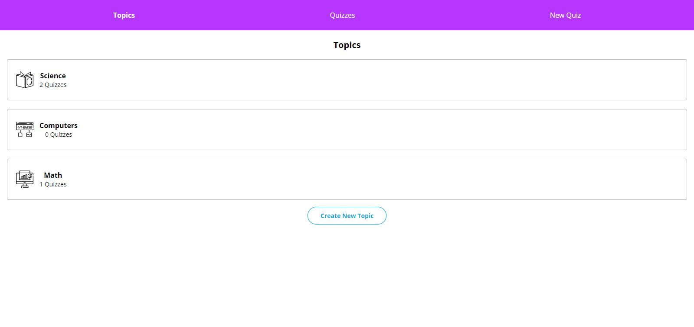
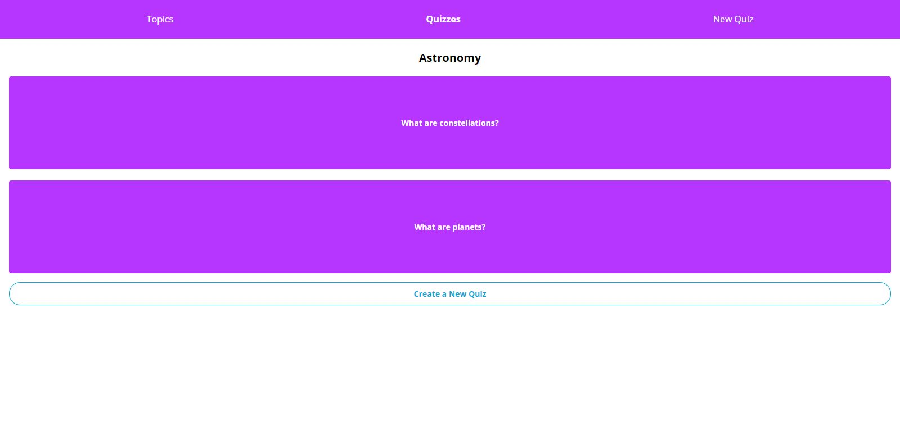

# Flashcards

Flashcards is one of Codecademy's open-ended projects, in which it is encouraged to problem solve and utilize other resources, instead of being provided with step-by-step guidance. The requirements were to utilize React Redux and Redux Toolkit to manage the complex state of a flashcard-style quiz React app. The app's external structure and design were pre-configured and consisted of pages to view and create topics, as well as others to create quizzes with flashcards associated with those topics. We were assigned the tasks of implementing the Redux logic for the state and interactivity between the store and the React components.

The specifications were:
1. Users should be able to create their own topics, quizzes for those topics, and flashcards for each quiz.
2. Users should also be able to interact with their quizzes by flipping the flashcards over.

## Table of Contents

- [Technologies](#technologies)
- [Screenshots](#screenshots)
- [Status](#status)

## Technologies

This project was created with:

- JavaScript ES6
- Node.js version: 14.15.1
- React version: 17.0.1
- React Router version: 5.2.0
- React Redux version: 7.2.2
- Redux Toolkit version: 1.5.0
- UUID version: 8.3.2

## Screenshots

## Status

This project has been completed.